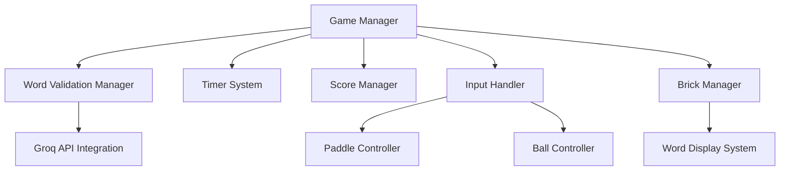
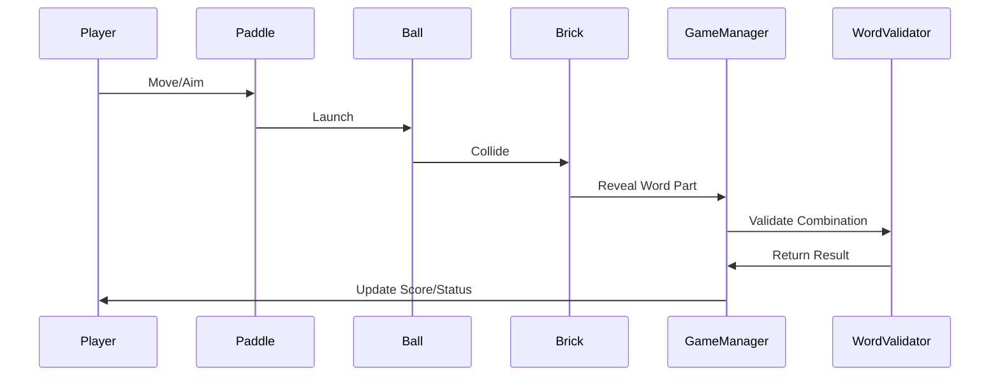
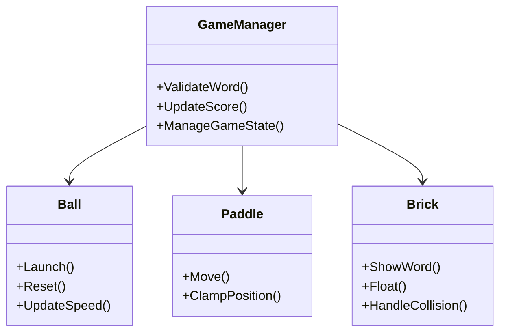
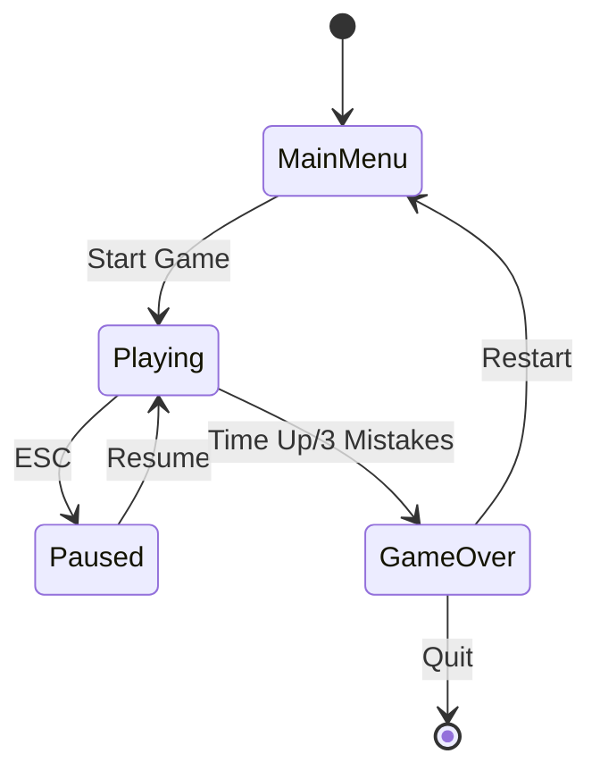

# Unity Word Matcher Game 🎮

A unique twist on the classic brick breaker game where players match word pairs while playing! Control a paddle, aim the ball, and hit bricks to reveal word parts. Match the correct word combinations to score points and beat the timer.

## 📺 Gameplay Demo
<!-- Add your gameplay video here -->

Click to see gameplay demo!

## 🎯 Game Features

- Classic paddle and ball mechanics with modern word-matching gameplay
- Intuitive aiming system with visual trajectory line
- Dynamic ball speed that increases based on:
  - Time remaining
  - Player score
- Floating bricks with word segments
- Combo scoring system with multipliers
- Word validation system using Groq API
- Time-based challenges
- Visual feedback for matched words
- Game over condition after 3 consecutive incorrect matches

## 🎮 Game Screenshots

## 🏗️ Architecture

### System Architecture

### Data Flow

## 🎮 How to Play

1. Control the paddle using arrow keys (← →)
2. Aim the ball using your mouse
3. Click to launch the ball
4. Hit bricks to reveal word parts
5. Match correct word combinations (e.g., UNI-TY, GA-ME)
6. Score points and achieve combos for higher multipliers
7. Complete as many words as possible before time runs out!

## 🏆 Scoring System

- Base points for matching words: 100 points
- Bonus points for consecutive matches: 20 points
- Score multiplier increases with consecutive correct matches
- Time-based bonus points at the end of the game
- Maximum multiplier: 5x

## 💻 Technical Architecture

### Component Structure

## 🔧 Core Components

Paddle: Handles player movement and ball attachment
Ball: Manages ball physics, aiming, and speed adjustments
Brick: Controls word display, floating animation, and collision detection
GameManager: Handles scoring, word validation, and game state
Timer: Manages game time and time-based mechanics

## 🛠️ Technical Features

- Smooth paddle movement with screen boundary detection
- Dynamic ball physics with speed adjustment
- Word validation using Groq API integration
- Floating animation for bricks
- Timer system
- Combo tracking system
- Score multiplier mechanics
- TextMeshPro integration for clear text display

## 🔄 Game States

## 📝 Prerequisites

- Unity 2020.3 or later
- TextMeshPro package
- Newtonsoft.Json package

## 🔑 API Configuration

Before running the game, make sure to:
1. Set up your Groq API key
2. Configure the validation endpoint in GameManager.cs
3. Test the word validation system

## 🎮 Controls

- **Left Arrow/Right Arrow**: Move paddle
- **Mouse**: Aim ball
- **Left Click**: Launch ball

## 🎯 Development Roadmap

### Phase 1 (Current)
- ✅ Basic gameplay mechanics
- ✅ Word matching system
- ✅ Score tracking
- ✅ Timer implementation

### Phase 2 (Planned)
- 🔲 Power-up system
- 🔲 Level progression
- 🔲 Sound effects
- 🔲 Background music

### Phase 3 (Future)
- 🔲 Online leaderboard
- 🔲 Multiple game modes
- 🔲 Achievement system
- 🔲 Social features

## 🤝 Contributing

Contributions are welcome! Please feel free to submit a Pull Request.

## 📄 License

This project is licensed under the MIT License - see the [LICENSE.md](LICENSE.md) file for details.

## 📞 Contact

For any queries or suggestions, please reach out to:
- Email: reddyjahnavi36@gmail.com
